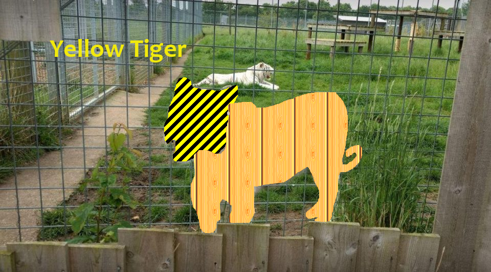

＃什麼山

<!DOCTYPE html>
<html>
	
 <head>
  <title> Tommy Kuo 10-1 </title>
 </head>
 <body bgcolor="green" text="blue">
  
 <h1 style= "border:10px dashed red; text-align:center"> <b> <i> <u>World's good<u>
 
 

  Lake is beautiful and there have fresh air.
 
 
  

 

  The building is awesome and special design.
 

  

 

   Beautiful flower make people good thinking.
  

  

 

   
 

  

 

  Relationship Communication with animal. 
 

  

 

  can make more friend.
 

  

 

  Get into the nature world, feel the fresh air.
 

  

 

  Friends can make you smoothly in subject.
 

  

 

  Taipei 101 is the highest building in Taiwan.
 

  

 

  These cute animal are looking sad.
 

  

 

  
 

<html>
